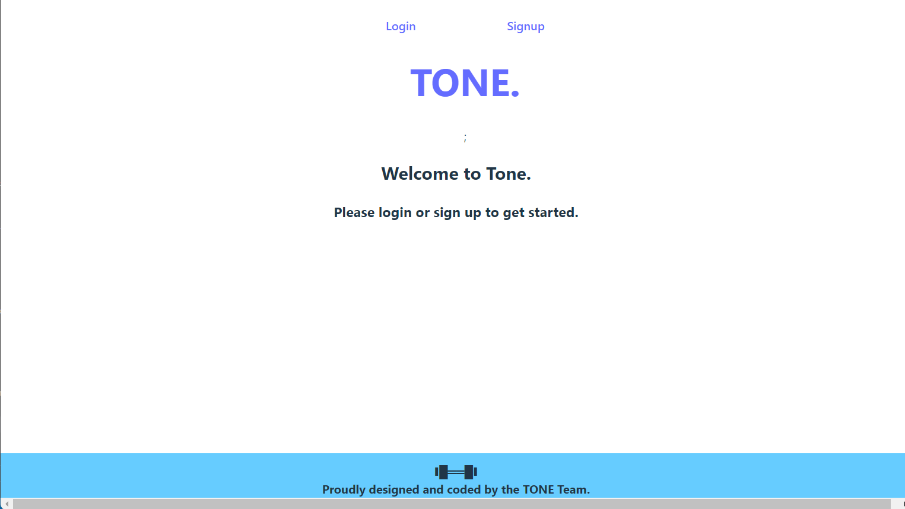
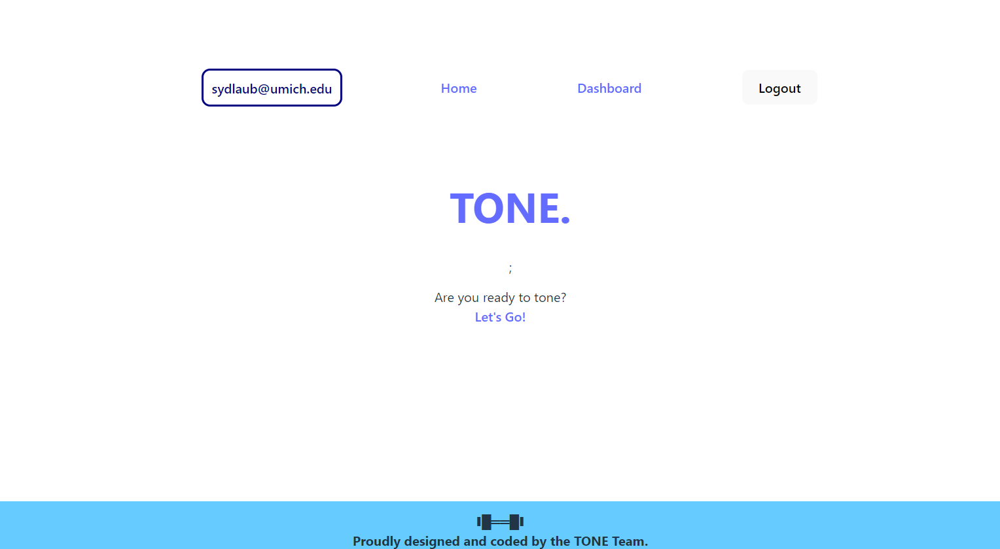
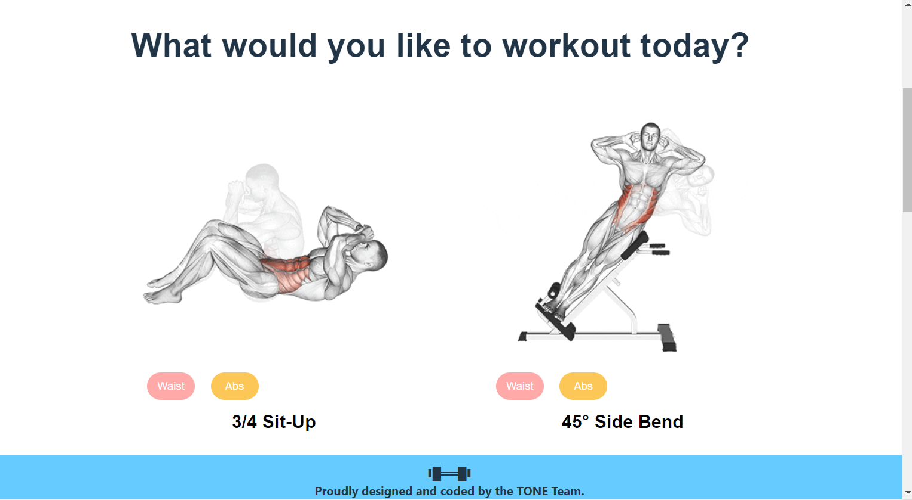
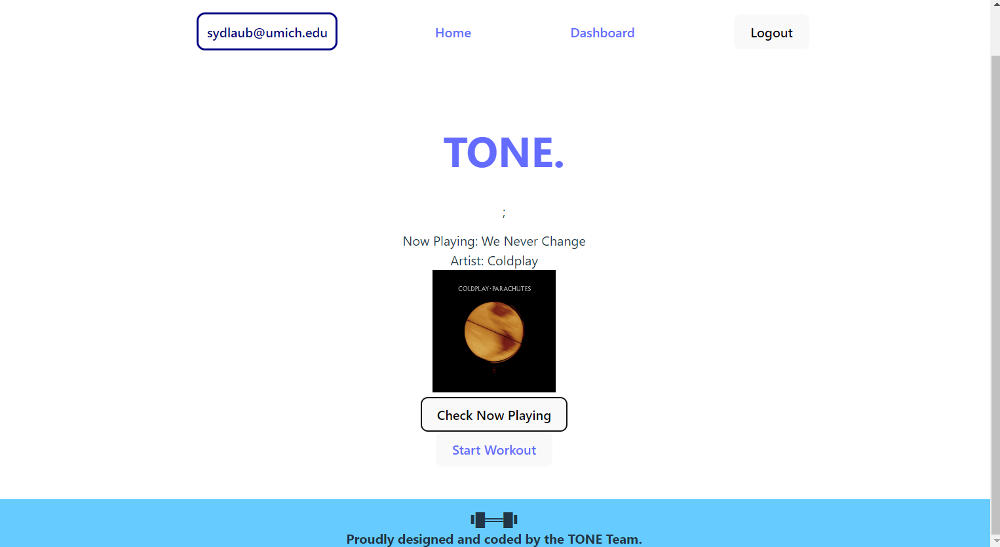
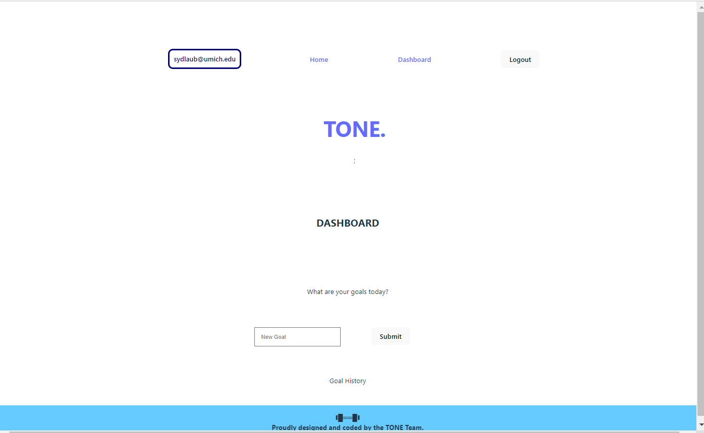

# TONE.

## Table of Contents
* [Description](#description)
* [Links](#links)
* [Screenshots](#screenshots)
* [Installation](#installation)
* [Usage](#usage)
* [Technologies Used](#technologies)
* [Contributing](#contributing)
* [License](#license)


## Description
This application uses MongoDB, Express, React, Node, and GraphQL to create a fitness application using ExerciseDB and Spotify APIs

## Links
[Deployed application on Heroku]()
[Github repository]()

## Screenshots
Landing page:


Home page:


New exercise:


Spotify connect page:


Profile page:



## Installation
If you want to run a copy of this app on your local machine, first clone the repository:

HTTPS:
```
$ git clone git@github.com:sydlaub/fitness-app.git
```

SSH:
```
$ git clone https://github.com/sydlaub/fitness-app.git

```

Then cd/ into the cloned directory and download the dependencies by typing into the command line
```
$ npm install --save
```

Once the dependencies are installed, start the application by typing into the command line
```
$ npm start
```

## Usage
This project is intended to create a fitness program with curated music choices using ExerciseDB and Spotify's APIs.

## Technologies Used
[](https://www.mongodb.com/) [](https://expressjs.com/) [](https://reactjs.org/) [](https://nodejs.org/en/) [](https://graphql.org/) [](https://mongoosejs.com/) [](https://jwt.io/)

## Tests

npm run test

## Contributing
- Sydney Laub: https://github.com/sydlaub
- Steve Kim: https://github.com/won-shy

## Questions

If you have further questions, you can reach me at syd.laub18@gmail.com. For more of my work, see [my GitHub](https://github.com/sydlaub).

## License

